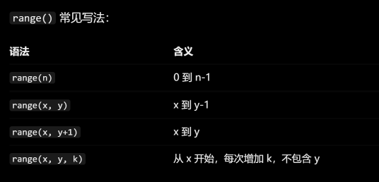
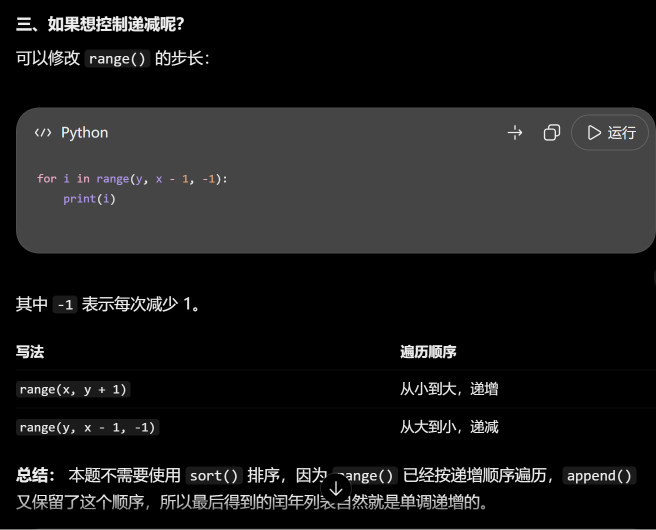

# Python 语法总结

## 1.输入一个字符串

```python
s=input()
print(s)
```

## 2.输入一个整数

```python
n=int(input())
print(n)
```

## 3.输入多个字符串

```python
a,b=input().split()
```

## 4.输入多个整数

```python
a,b=map(int,input().split())
#两个整数 空格分隔
```

```python
nums=list(map(int,input().split()))
#一行多个整数 空格分隔
```

## 5. for 循环

```python
for 变量 in 可迭代对象:
    循环执行的代码
```

## 6. if 语句
```python
if 条件：
    执行语句
```
## 7. range 写法



## 8.
append()：向列表添加元素

append() 每次添加一个元素到列表末尾

## 9. 列表
```python
a = []                    # 空列表
b = [""]                  # 包含一个空字符串的列表
c = ["Alice"]             # 包含一个名字的列表
d = ["Alice", "Bob", "Tom"] # 包含三个名字的列表
e = [1, 2, 3]             # 包含三个整数的列表
```
